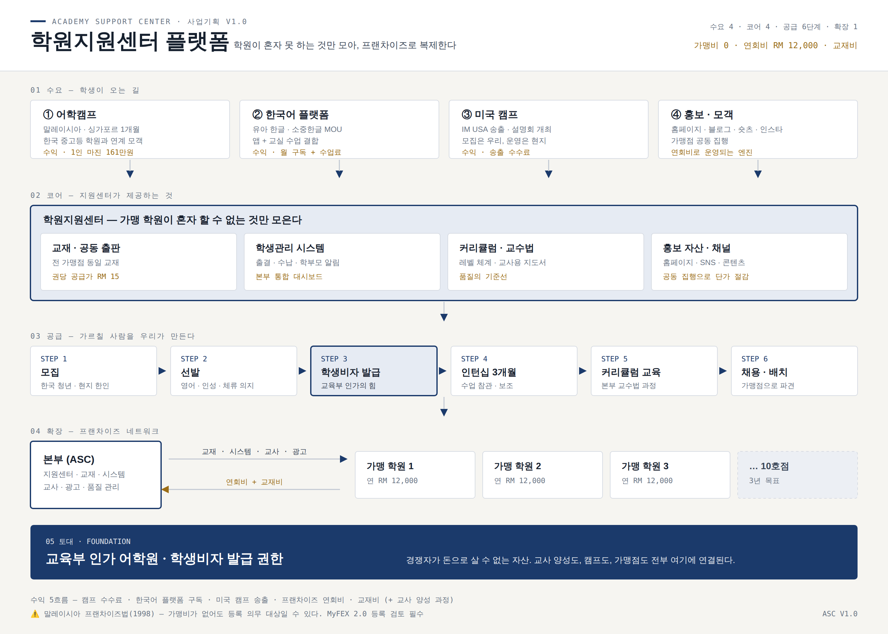

# 학원지원센터 플랫폼 — 사업기획서 v1.0

> 말레이시아 어학원을 **플랫폼화**하고, 프랜차이즈로 복제한다.
> 1페이지: 구조도 (`one-page.png` / `one-page.svg`) · 2페이지부터: 카테고리별 세부

---

## 1페이지 — 구조도

**읽는 법** — 위에서 아래로 흐른다.
① 수요(학생이 오는 길) → ② 코어(지원센터가 제공하는 것) → ③ 공급(가르칠 사람) → ④ 확장(프랜차이즈) → ⑤ 토대(인가·비자).
**토대가 맨 아래 있는 이유**는, 위의 모든 것이 여기에 연결되어 있기 때문이다.

---

# 2페이지 — 플랫폼 개요

## 한 문장 정의

> **학원 하나가 혼자서는 못 하는 것(교재·시스템·교사·광고)만 모아서 만들고,
> 그것을 쓰는 학원을 늘려 나가는 지원센터.**

가맹비를 받지 않는 이유가 여기서 나온다. 우리는 **간판을 파는 것이 아니라 운영을 파는 것**이다.

## 이름 가안

| # | 가안 | 성격 |
|---|---|---|
| 1 | **ASC — Academy Support Center (학원지원센터)** ← 추천 | 기능이 그대로 이름. 가맹점이 "본사"가 아니라 "지원센터"로 인식한다 |
| 2 | EduBridge Asia | 한국–말레이시아–미국을 잇는다는 의미 |
| 3 | 허브스쿨 (HUB SCHOOL) | 짧고 기억하기 쉬움 |

**추천: 1번.** 근거 2가지 — ① 가맹비 0 · 연회비만 받는 모델의 철학과 이름이 일치한다. ② "본사"라는 단어가 주는 상하관계를 처음부터 피할 수 있다.

## 4층 구조

| 층 | 이름 | 내용 | 역할 |
|---|---|---|---|
| **05** | **토대** | 교육부 인가 어학원 · 학생비자 발급 권한 | 복제 불가능한 해자 |
| 04 | 확장 | 프랜차이즈 네트워크 (연회비 + 교재비) | 매출의 반복성 |
| 03 | 공급 | 교사 양성 6단계 | 확장의 병목을 푸는 열쇠 |
| 02 | 코어 | 교재 · 학생관리 시스템 · 커리큘럼 · 홍보 자산 | 플랫폼의 실체 |
| 01 | 수요 | 어학캠프 · 한국어 플랫폼 · 미국 캠프 · 홍보 | 학생이 들어오는 입구 |

### 이 구조의 핵심 한 가지

보통 학원 프랜차이즈가 무너지는 지점은 **교사 수급**이다. 점포는 늘렸는데 가르칠 사람이 없다.
우리는 **교육부 인가 어학원이라 학생비자를 줄 수 있고**, 그래서 사람을 데려와 길러서 배치할 수 있다.
**이것이 이 사업의 유일하면서 가장 강력한 차별점이다.** 다른 모든 항목은 돈으로 살 수 있지만 이것은 못 산다.

## 수익 5흐름

| # | 흐름 | 성격 | 주기 |
|---|---|---|---|
| 1 | 어학캠프 수수료·마진 | 계절성, 금액 큼 | 연 2회 |
| 2 | 한국어 플랫폼 (본부 몫) | 반복 매출 | 월 |
| 3 | 미국 캠프 송출 수수료 | 계절성 | 연 1~2회 |
| 4 | 프랜차이즈 연회비 | **반복 매출** | 연 (분기 분납 권장) |
| 5 | 교재비 | 학생 수에 비례 | 분기 |
| + | 교사 양성 과정 수강료 | 공급과 수익을 동시에 | 기수별 |

---

# 3페이지 — 토대: 인가와 비자, 그리고 교사 양성

## 왜 이것이 1순위인가

교육부 인가 어학원은 **학생비자(Student Pass)를 발급받게 해 줄 수 있다.** 이 권한이 세 가지를 동시에 푼다.

1. **교사 공급** — 사람을 한국에서 데려와 합법적으로 체류시키며 기를 수 있다
2. **캠프 장기화** — 3개월을 넘는 프로그램도 설계할 수 있다
3. **가맹점 유인** — 가맹 학원이 가장 아쉬워하는 것이 교사다. 본부가 교사를 보내 준다면 연회비는 싸게 느껴진다

## 교사 양성 6단계

| 단계 | 내용 | 기간 | 산출물 |
|---|---|---|---|
| 1 · 모집 | 한국 청년 · 현지 한인 · 영어권 지원자 | 상시 | 지원자 풀 |
| 2 · 선발 | 영어 능력 · 인성 · **체류 의지** 3축 평가 | 2주 | 기수별 10~15명 |
| 3 · **학생비자** | 어학원 등록 → Student Pass 발급 | 4~8주 | 합법 체류 |
| 4 · 인턴십 | 수업 참관 · 보조 · 교재 연구 | 3개월 | 참관 일지 |
| 5 · 커리큘럼 교육 | 본부 교수법 과정 · 모의수업 · 평가 | 3개월 | **수료증** |
| 6 · 채용 · 배치 | 직영 또는 가맹점 배치, 신분 전환 | — | 교사 1명 |

**선발에서 '체류 의지'를 영어보다 먼저 본다.** 영어는 가르칠 수 있지만, 6개월 만에 돌아갈 사람에게 들인 비용은 돌아오지 않는다.

## ⚠️ 반드시 확인할 법적 사항 3가지

| # | 사항 | 왜 |
|---|---|---|
| 1 | **Student Pass 소지자의 근로 범위** | 학생비자 상태에서 보수를 받는 수업 보조는 제한될 수 있다. 인턴십은 **교육과정의 일부**로 설계하고, 보수 지급 여부는 반드시 자문을 받는다 |
| 2 | **채용 시 신분 전환** | 수료 후 정식 교사가 되려면 Employment Pass 등으로 전환이 필요하다. 전환 요건(학위·급여 기준)을 미리 확인한다 |
| 3 | **가맹점 파견** | 본부가 비자를 받고 가맹점에서 일하면 '고용주 불일치' 문제가 생긴다. **고용 주체를 어디로 둘지** 구조를 먼저 정한다 |

> 이 세 가지는 사업 구조 자체를 바꿀 수 있다. **현지 이민 전문가 자문 1회를 가장 먼저 집행한다.**

---

# 4페이지 — ① 어학캠프 (말레이시아 · 싱가포르)

## 상품 구조

- **기간**: 한국 방학 — 여름(7월 중순~8월 중순), 겨울(1월) · 4주 기본형 + 2주 단기형
- **대상**: 초4 ~ 고1
- **구성**: 어학원 수업 + **방과후 학습(숙제·한국 수학)** + 숙식 + 주말 액티비티 + 싱가포르 1박2일 + **대학 탐방**

**차별점은 방과후 2시간이다.** 한국 학부모가 가장 불안해하는 것은 "한 달 놀다 오면 수학 다 까먹는다"이다. 한국 수학 진도를 봐 주는 캠프는 설명이 필요 없다.

## 한국 중고등 학원과의 연계 — 이번 기획의 새 축

개별 모객은 비용이 크고 느리다. **한국의 중고등 학원 한 곳과 손잡으면 그 학원의 학부모 전체가 모객 대상이 된다.**

| 항목 | 내용 |
|---|---|
| 제휴 대상 | 한국 중소도시 영어·수학 학원 (원생 200명 이상), 교회 부설 공부방 |
| 학원 측 역할 | 설명회 장소 제공, 학부모 공지, 인솔교사 1명 파견 |
| 학원 측 보상 | **1인당 소개 수수료** 또는 인솔교사 경비 전액 부담 |
| 우리 역할 | 상품 설계, 현지 운영, 안전 관리, 리포트 발송 |
| 설명회 | 모객 2개월 전, 학원 교실에서 1시간 — **사진과 일과표가 전부다** |

**연계 학원 3곳만 확보하면 캠프 모객 문제는 끝난다.** 캠프 사업의 진짜 과제는 현지 운영이 아니라 한국에서의 신뢰 확보다.

## 원가와 가격 (가안 · 환율 RM 1 = 330원)

| 항목 | 1인 (RM) |
|---|---:|
| 어학원 수업료 (주 20시간 × 4주) | 2,400 |
| 숙식 28일 (3식) | 3,360 |
| 방과후 학습 관리 | 800 |
| 주말 액티비티 + 싱가포르 1박2일 | 1,200 |
| 픽업 · 교통 · 보험 | 400 |
| 인솔교사 분담 | 600 |
| **원가 합계** | **8,760 (약 289만원)** |
| 판매가 (항공 별도) | **450만원** |
| **1인 마진** | **약 161만원 (36%)** |

15명 기준 1회 마진 약 2,400만원. 연 2회면 4,800만원이다.

---

# 5페이지 — ② 한국어 플랫폼 (소중한글 MOU)

## 왜 유아 한국어인가

| 근거 | 내용 |
|---|---|
| 수요 | 말레이시아 거주 한인 가정 + 한류 기반 현지 수요 + 다문화 가정 |
| 반복성 | 캠프는 1년에 두 번이지만, **한글 수업은 매달 들어온다** |
| 연령 확장 | 유아로 들어온 학생이 초등 영어로 이어진다. **고객 생애주기가 길어진다** |

## 소중한글 — 확인된 사실

- H2K Research가 개발한 한글 학습 앱. **2~4세용**과 **5~7세용**으로 나뉜다
- 60만 학부모와 300개 이상 초등학교가 사용 중이라고 밝히고 있다
- **AI 진단 기반 개인화 커리큘럼** (언어치료사·교사 + KAIST AI 전문가 참여)
- 영어 교육에서 검증된 **파닉스 방식**을 한글에 적용, 게임형 콘텐츠 300개 이상

> 위는 공개 자료(앱스토어·구글플레이 소개) 기준이다. **MOU 협상 전 반드시 직접 확인한다.**

## 수업 모델 — 앱만으로는 학원 수익이 안 난다

**앱 + 교실 결합이 핵심이다.**

| 요소 | 내용 |
|---|---|
| 교실 | 주 2회 × 50분, 1반 6~8명 |
| 홈러닝 | 소중한글 앱, 주 5일 하루 10분 |
| 교사 | 본부 양성 교사 (한국어 가능자) |
| 리포트 | 월 1회 학부모 리포트 — 앱 진도 + 교실 관찰 |
| 가격 가안 | 월 RM 200~250 (교실 + 앱 계정 포함) |
| 본부 몫 | 학생당 월 RM 50 내외 (라이선스 + 콘텐츠 + 교사 지원) |

## MOU 체크리스트 10가지

- [ ] **지역 독점권** — 말레이시아 전역인가, 특정 주(州)인가
- [ ] **라이선스 단가** — 계정당 / 학원당 / 정액 중 무엇인가
- [ ] 최소 보장 수량(MG) 요구가 있는가
- [ ] **현지화** — 영어·말레이어 UI/안내가 필요한가, 비용은 누가 대는가
- [ ] 오프라인 수업 결합 허용 범위 (앱을 수업 교재로 써도 되는가)
- [ ] 브랜드·로고 사용 범위 (간판·전단·SNS)
- [ ] **학습 데이터 소유권**과 개인정보 처리 (말레이시아 PDPA 적용)
- [ ] 기술 지원 — 장애 대응, 업데이트 주기
- [ ] 계약 기간 · 갱신 · 해지 조건
- [ ] 수익 배분 또는 정산 주기

**협상 포인트** — 우리는 단순 재판매자가 아니라 **해외 오프라인 거점**이다. 소중한글 입장에서 말레이시아 교실 수업 데이터는 해외 진출 레퍼런스가 된다. 그 가치를 단가 협상에 쓴다.

---

# 6페이지 — ③ 미국 캠프 (IM USA 연계)

## 구조

**모집은 우리, 운영은 현지.** 우리가 리스크를 지지 않는 구조로 시작한다.

| 역할 | 우리 | IM USA |
|---|---|---|
| 모집 | ● 한국·말레이시아 | |
| 설명회 | ● 개최 | 자료 제공 |
| 계약·수납 | 협의 (가급적 현지 직접 수납) | ● |
| 현지 운영·안전 | | ● |
| 사후 리포트 | ● 학부모 전달 | ● 작성 |

**수수료 모델**: 1인당 정액(가안 RM 2,000) 또는 총액의 10~15%. 정액이 분쟁이 적다.

## ⚠️ 실사(Due Diligence) 체크리스트 — 보내기 전에 반드시

| # | 확인 항목 | 왜 |
|---|---|---|
| 1 | 법인 등록증 · 운영 연수 | 실체 확인 |
| 2 | **보험 가입 증서** (학생 상해·배상책임) | 사고 시 유일한 방패 |
| 3 | 인솔자 1인당 학생 수 | 10명 이하가 기준 |
| 4 | 숙소 형태 — 홈스테이 / 기숙 | 홈스테이는 호스트 검증 절차 확인 |
| 5 | **과거 사고 이력과 처리 과정** | 사고가 없었다는 답보다 처리 과정이 중요 |
| 6 | 환불 규정 (문서) | |
| 7 | **레퍼런스 2곳** — 작년 참가 학부모 직접 통화 | 가장 확실한 검증 |
| 8 | 현지 비상 연락 체계 | 한국 시간 기준 대응 가능한가 |
| 9 | 프로그램 일과표와 교사 자격 | |
| 10 | **미국 입국 신분** — 단기 캠프의 비자 유형 | 'B-2/ESTA로 학업'은 제한이 있다. 캠프 성격을 명확히 하고 확인 |

> 7번과 10번을 건너뛰지 않는다. 미국 캠프는 금액이 크고 거리가 멀어, 문제가 생기면 수습할 방법이 없다.

## 세미나 전략

미국 캠프는 **설명회가 곧 모객**이다. 1회 설명회 → 참가 신청 전환율 10~15%를 기준으로 잡는다.
설명회 구성: 현지 영상 10분 → 작년 참가자 인터뷰 10분 → 일정·비용 20분 → 개별 상담 30분.

---

# 7페이지 — ④ 홍보 · 모객

## 자산 4개와 역할

| 채널 | 역할 | 성공 지표 |
|---|---|---|
| **홈페이지** | 허브 — 모든 링크가 모이는 곳, 신뢰의 근거 | 문의 폼 전환율 |
| **블로그** | 검색 유입 — "말레이시아 어학연수", "KL 국제학교" | 상위 노출 키워드 수 |
| **숏츠 / 릴스** | 도달 — 모르는 사람에게 닿는 유일한 수단 | 조회수 · 저장 |
| **인스타** | 신뢰 — 실제로 굴러가고 있다는 증거 | DM 문의 수 |

## 콘텐츠 4축

1. **캠프 현장** — 아이들 수업·액티비티 (학부모 동의 필수)
2. **학생 성장 사례** — 입학 전/후 (가장 전환율이 높다)
3. **선생님 이야기** — 교사 양성 과정 참가자의 성장기 → **교사 모집과 동시 작동**
4. **말레이시아 교육·생활 정보** — 검색 유입용

## 주간 생산 리듬 (1인 기준)

| 요일 | 할 일 |
|---|---|
| 월 | 주간 소재 3개 선정 |
| 화·목 | 촬영 (현장 10분이면 충분) |
| 수 | 블로그 1편 |
| 금 | 숏츠 3개 편집·예약 업로드 |
| 상시 | 인스타 스토리 (즉시성) |

**자동화**: 다채널 업로드와 성과 수집은 **Playwright 스크립트로 처리**한다. 사람이 할 일은 촬영과 한 줄 카피까지다.

## KPI

팔로워 수가 아니라 **문의 수**로 평가한다. 팔로워 1만 명보다 월 문의 20건이 낫다.
가맹점 입장에서도 "우리 지역 문의를 본부가 넘겨준다"가 연회비의 가장 직접적인 근거가 된다.

---

# 8페이지 — ⑤ 교재 · 공동 출판

## 왜 교재가 프랜차이즈의 심장인가

가맹비를 받지 않기로 했으므로, **반복 수익은 교재에서 나온다.** 동시에 교재는 **품질 통제 장치**다.
같은 교재를 쓰면 어느 지점에 가도 같은 수업이 되고, 교사 교육도 하나로 묶인다.

## 라인업

| 라인 | 대상 | 권수 |
|---|---|---|
| 캠프 4주 완성 | 캠프 참가자 | 1권 + 단어장 |
| 정규 영어 (레벨 1~6) | 초등~중등 | 레벨당 2권 |
| 한국어 (소중한글 연계 워크북) | 유아~초등 | 단계별 |
| 교사용 지도서 | 전 교사 | 교재별 1권 |

**교사용 지도서를 반드시 같이 만든다.** 교재만 주면 안 쓴다. 교사가 준비 없이 들어가도 수업이 되는 1쪽 요약이 있어야 실제로 쓰인다.

## 단가 구조 (가안)

| 항목 | 금액 (RM) |
|---|---:|
| 제작 원가 (인쇄·물류) | 8 |
| 가맹점 공급가 | 15 |
| **권당 본부 마진** | **7** |
| 학생 1인 연간 사용 권수 | 4권 |
| 가맹점 1곳(재학 150명) 연간 | 600권 |
| **가맹점당 연 교재 수익** | **RM 4,200** |

---

# 9페이지 — ⑥ 학생관리 시스템

## 플랫폼의 등뼈

학원마다 따로 쓰는 프로그램이 아니라, **본부가 전 가맹점을 하나의 화면으로 보는 시스템**이다.
이것이 있어야 프랜차이즈가 '간판 빌려주기'에서 '운영 지원'으로 올라간다.

## 3단계 구축

| 단계 | 범위 | 기간 |
|---|---|---|
| 1단계 | 출결 + **학부모 자동 알림** + 학생 마스터 | 4~6주 |
| 2단계 | 수납·미납 + 성적·레벨 이력 + 월말 리포트 자동화 | 6~8주 |
| 3단계 | 캠프 모듈 + 강사 시수·급여 + **멀티 가맹점(본부 대시보드)** | 8~10주 |

## 본부 대시보드가 보여줄 것

가맹점별 — 재학생 수 · 월 매출 · 출결률 · 교재 소진량 · 교사 배치 현황 · 미납액

**교재 소진량이 핵심 지표다.** 교재가 안 나간다는 것은 학생이 줄고 있다는 뜻이고, 숫자가 떨어지는 가맹점에 본부가 먼저 찾아갈 수 있다.

## 기술·법무

- 웹 기반(설치 없음), 휴대폰 우선 설계
- 기존 엑셀·시트는 **Playwright로 이관** — 손으로 옮기게 하지 않는다
- 알림은 WhatsApp 우선, 한국 학부모는 카카오 병행
- **PDPA 2010** — 미성년자 정보 수집 동의서·보관 기간·접근 권한을 1단계부터 설계

---

# 10페이지 — ⑦ 프랜차이즈 모델

## 구조: 가맹비 0 · 연회비만 · 교재비

### 왜 이 모델이 영리한가 (3가지)

1. **진입 장벽 제거** — 가맹비 수천만원이 없으면 결정이 빨라진다. 점포 수 확보 속도가 달라진다
2. **분쟁 리스크 감소** — 프랜차이즈 분쟁의 대부분은 가맹비 반환을 둘러싸고 생긴다. 애초에 없으면 생기지 않는다
3. **수익이 성과에 연동** — 교재비는 학생 수에 비례한다. 가맹점이 잘되면 본부가 번다. **이해관계가 같은 방향을 본다**

### 연회비 구성 (가안)

| 항목 | 월 환산 (RM) | 연 (RM) |
|---|---:|---:|
| 광고·마케팅 공동 집행 | 400 | 4,800 |
| 홈페이지·랜딩 제작 및 관리 | 250 | 3,000 |
| 학생관리 시스템 사용료 | 300 | 3,600 |
| 교사 채용·양성 지원 | 50 | 600 |
| **합계** | **1,000** | **12,000** |

**연회비 내역을 공개한다.** 무엇에 쓰는지 보여주는 것이 가맹점 유지율을 올린다.
현금흐름을 위해 **분기 분납(RM 3,000 × 4회)**을 권한다.

## ⚠️ 가장 먼저 해결할 것 — 말레이시아 프랜차이즈법 (Franchise Act 1998)

| 사실 | 내용 |
|---|---|
| 등록 의무 | 국내·해외 프랜차이저 모두 **영업 개시 또는 판매 제안 전에** 등록해야 한다 |
| 창구 | **MyFEX 2.0** 포털 |
| 유효기간 | 등록 후 **5년**, 만료 30일 내 갱신 |
| 연례 보고 | 회계연도 종료 후 **6개월 내** 보고서 제출 |
| 미등록 벌금 | 법인 **최대 RM 250,000** (재범 RM 500,000) |

**"가맹비를 안 받으니 프랜차이즈가 아니다"는 통하지 않을 가능성이 높다.** 상표 사용 허락 + 운영 방식 통제 + 대가(연회비·교재비)가 있으면 실질이 프랜차이즈다.

**선택지 2가지**

| 안 | 내용 | 평가 |
|---|---|---|
| **A. 정식 등록** | MyFEX 2.0에 프랜차이즈 등록 | **권장.** 비용은 들지만 10호점까지 갈 사업이라면 피할 수 없다 |
| B. 비(非)프랜차이즈 구조 | 상표를 쓰지 않는 '회원제 지원 서비스'로 설계 | 실질로 판단되므로 변호사 확인 전에는 안전하다고 보지 않는다 |

> **1호 가맹점을 받기 전에 변호사 자문을 끝낸다.** 등록 없이 가맹을 모집하면 그 자체가 위반이다.

## 품질 관리 3중 장치 (가맹비가 없으므로 통제가 약하다)

1. **교재 사용 의무** — 본부 교재만 사용. 미사용 시 연회비 할인 혜택 중단
2. **교사는 본부 양성 인력 우선 배치** — 가장 강력한 통제이면서 가장 환영받는 지원
3. **연 1회 품질 심사** — 출결률·학부모 만족도·교재 소진량. **3진 아웃 후 계약 종료**

---

# 11페이지 — 수익 모델과 3년 추정

> **전부 가정치다.** 환율 RM 1 = 330원. 실제 단가가 확인되면 전면 갱신한다.

| 항목 | 1년차 (직영 1) | 2년차 (가맹 3) | 3년차 (가맹 10) |
|---|---:|---:|---:|
| 어학캠프 | 73,000 | 146,000 | 195,000 |
| 한국어 플랫폼 (본부 몫) | 27,000 | 72,000 | 240,000 |
| 미국 캠프 송출 | — | 20,000 | 40,000 |
| 프랜차이즈 연회비 | — | 36,000 | 120,000 |
| 교재비 | — | 12,600 | 42,000 |
| 교사 양성 과정 | 30,000 | 60,000 | 90,000 |
| **합계 (RM)** | **130,000** | **346,600** | **727,000** |
| **원화 환산** | 약 4,300만원 | 약 1억 1,400만원 | **약 2억 4,000만원** |

**본부 고정비 가안** (인건비 2~3인 · 사무실 · 공동광고): 3년차 기준 월 RM 25,000 → 연 RM 300,000.
→ 3년차 영업이익 **약 RM 427,000 (약 1억 4,000만원)**.

### 이 표에서 주목할 한 줄

**2년차부터 연회비와 교재비가 들어오기 시작한다.** 캠프 매출은 계절을 타지만 이 둘은 매년 반복된다.
**사업의 안정성은 가맹점 수에서 나온다.** 그래서 1~2년차의 진짜 목표는 매출이 아니라 **1호점의 성공 사례**다.

---

# 12페이지 — 로드맵 · 리스크 · 다음 30일

## 로드맵

| 단계 | 기간 | 목표 | 완료 기준 |
|---|---|---|---|
| **Phase 0** | 0~3개월 | 토대 정리 | 비자·프랜차이즈법 자문 완료, 학생관리 1단계 가동, 소중한글 접촉 |
| **Phase 1** | 3~9개월 | 상품 검증 | 겨울캠프 1기 15명, 교사 양성 1기 10명, 한국어 교실 개설 |
| **Phase 2** | 9~18개월 | 복제 가능성 증명 | **가맹 1~3호점**, 교재 정규 라인 출간, 프랜차이즈 등록 |
| **Phase 3** | 18~36개월 | 확장 | 10호점, 미국 캠프 정례화, 본부 대시보드 완성 |

## 리스크 매트릭스

| 리스크 | 가능성 | 영향 | 대응 |
|---|:---:|:---:|---|
| **프랜차이즈법 미등록** | 높음 | 치명적 | 1호점 전에 변호사 자문 · MyFEX 등록 |
| **학생비자 인턴십의 근로 해당** | 중 | 높음 | 교육과정으로 설계, 보수 지급 전 자문 |
| 소중한글 MOU 불발 | 중 | 중 | 자체 한글 커리큘럼 또는 대체 앱 병행 검토 |
| IM USA 운영 사고 | 낮음 | 치명적 | 실사 10항목 + 보험 확인 + 레퍼런스 통화 |
| 가맹점 품질 붕괴 | 중 | 높음 | 교재·교사·심사 3중 장치 |
| 본부 현금흐름 | 높음 | 중 | 연회비 분기 분납, 캠프 선수금 관리 분리 |
| 한국 모객 경쟁(필리핀) | 높음 | 중 | 가격이 아니라 **안전 + 수학 관리 + 싱가포르**로 승부 |

## 다음 30일 액션 10가지

| # | 할 일 | 기한 |
|---|---|---|
| 1 | 현지 변호사 — **프랜차이즈법 자문** 1회 | D+7 |
| 2 | 현지 이민 대행사 — 학생비자 인턴십 / EP 전환 자문 | D+7 |
| 3 | 어학원과 **플랫폼 구상 공유** (월요일 미팅의 연장) | D+10 |
| 4 | 학생관리 시스템 **1단계 화면 예시 1장** 제작 | D+10 |
| 5 | 소중한글(H2K Research) **접촉 메일 발송** | D+14 |
| 6 | IM USA **실사 체크리스트 송부** | D+14 |
| 7 | 한국 중고등 학원 **3곳 리스트업 + 1곳 접촉** | D+21 |
| 8 | 홈페이지 랜딩 1페이지 + 인스타 개설 | D+21 |
| 9 | 캠프 원가표를 **실제 단가로 갱신** | D+25 |
| 10 | 교사 양성 1기 **모집 공고안** 작성 | D+30 |

---

## 참고 자료

- [Registering a Franchise in Malaysia — Franchise Act 1998 & MyFEX 2.0](https://www.mirf.my/franchise-registration-malaysia/)
- [Malaysia: Franchise & Licensing — Legal500](https://www.legal500.com/guides/chapter/malaysia-franchise-licensing/)
- [Legal Issues in Franchise Framework — Azmi & Associates](https://www.azmilaw.com/insights/legal-issues-in-franchise-framework/)
- [International Franchise Law Tracker: Malaysia — Bird & Bird](https://www.twobirds.com/en/trending-topics/international-franchise-laws/page-components/international-franchise-law-tracker/malaysia)
- [소중한글: 놀면서 배우는 한글 — Google Play](https://play.google.com/store/apps/details?id=com.h2kresearch.preciousHangul)
- [소중한글(2-4세): 처음 배우는 한글 기초 — App Store](https://apps.apple.com/ai/app/id6473247195)
- [Student Visa Application User Guide — EMGS](https://visa.educationmalaysia.gov.my/media/docs/Student_Visa_Application_User_Guide.pdf)
- [The Employer's Guide To Malaysian Employment Pass Applications (2026) — MISHU](https://mishu.my/blog/visa/employment-pass-malaysia/)

---

*관련 문서 — 월요일 어학원 미팅 팩: `../malaysia-academy/README.md`*
