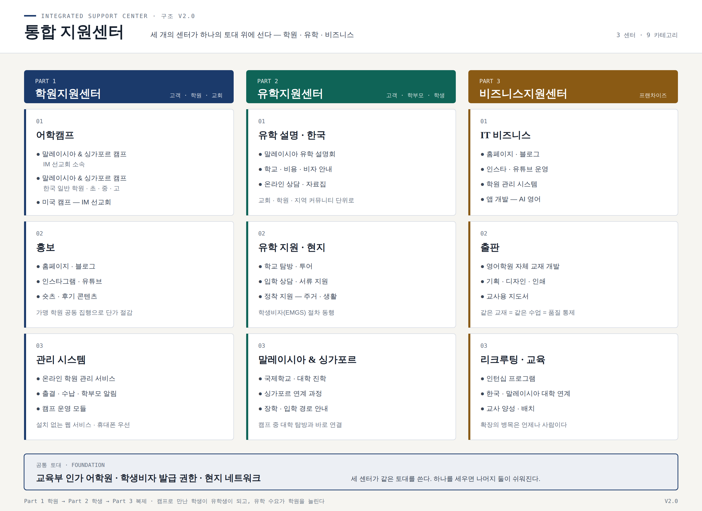

# 통합 지원센터 — 구조와 세부 계획 v2.0

> 세 개의 센터가 하나의 토대 위에 선다 — **학원 · 유학 · 비즈니스**
> 1페이지: 구조도 (`one-page.png` / `one-page.svg`) · 이후: 9개 카테고리 세부

---

## 1페이지 — 구조도

| | Part 1 학원지원센터 | Part 2 유학지원센터 | Part 3 비즈니스지원센터 |
|---|---|---|---|
| **고객** | 학원 · 교회 | 학부모 · 학생 | 학원 · 창업자 |
| 01 | 어학캠프 | 유학 설명 (한국) | IT 비즈니스 |
| 02 | 홍보 | 유학 지원 (현지) | 출판 |
| 03 | 관리 시스템 | 말레이시아 & 싱가포르 진학 | 리크루팅 · 교육 |

**세 센터가 이어지는 방식** — 캠프로 만난 학생이 유학생이 되고, 유학 수요가 학원을 늘리고, 학원이 늘면 교재·시스템·교사가 팔린다. **Part 1이 입구, Part 2가 전환, Part 3이 복제다.**

### 공통 토대

교육부 인가 어학원 · **학생비자 발급 권한** · 현지 네트워크.
세 센터가 같은 토대를 쓴다. **하나를 세우면 나머지 둘이 쉬워진다.**

---

# PART 1 · 학원지원센터

## 1-1. 어학캠프

세 가지 상품이다. **대상과 모객 채널이 다르므로 가격과 프로그램도 달라야 한다.**

| 구분 | A. 말·싱 캠프 (IM 선교회) | B. 말·싱 캠프 (한국 일반 학원) | C. 미국 캠프 (IM 선교회) |
|---|---|---|---|
| 대상 | 선교회·교회 소속 자녀 | 초 · 중 · 고 일반 학생 | 중 · 고 |
| 모객 채널 | 교회 · 선교 네트워크 | **한국 학원 제휴** | 교회 + 설명회 |
| 가격대 | 낮게 (실비 중심) | 450만원대 (항공 별도) | 높음 |
| 프로그램 | 어학 + 신앙 + 봉사 | 어학 + **한국 수학** + 대학 탐방 | 어학 + 미국 문화 |
| 운영 주체 | 우리 + 현지 어학원 | 우리 + 현지 어학원 | **IM USA (현지 운영)** |
| 수익 구조 | 운영 실비 + 소액 마진 | 1인 마진 약 161만원 | 송출 수수료 (1인 RM 2,000 가안) |

### 공통 4주 일과 (A · B)

| 시간 | 내용 |
|---|---|
| 09:00–12:00 | 어학원 정규 수업 |
| 13:30–15:30 | 회화 · 액티비티 |
| **16:00–18:00** | **방과후 학습 — 숙제 · 한국 수학 · 영어 일기** |
| 19:30–21:00 | 자율학습 · 단어 시험 · 하루 보고 |

주말 — 액티비티 2~3회 + **싱가포르 1박2일** + **대학 탐방 1~2곳**(사전 공문 필수).

### 원가와 가격 (B 기준 · 가안 · RM 1 = 330원)

| 항목 | 1인 (RM) |
|---|---:|
| 어학원 수업료 (주 20시간 × 4주) | 2,400 |
| 숙식 28일 | 3,360 |
| 방과후 학습 관리 | 800 |
| 액티비티 + 싱가포르 | 1,200 |
| 픽업 · 교통 · 보험 | 400 |
| 인솔교사 분담 | 600 |
| **원가** | **8,760 (약 289만원)** |
| 판매가 / 마진 | **450만원 / 161만원 (36%)** |

### A와 B를 나누는 이유

**선교회 캠프에 일반 학생을 섞으면 둘 다 잃는다.** 교회 학부모는 "왜 이렇게 비싸냐"고 하고, 일반 학부모는 "왜 예배를 드리냐"고 한다. **기수를 분리한다.** 다만 **현지 운영·숙소·교재는 공유**해 원가를 낮춘다.

### C(미국 캠프) — 보내기 전 실사 10항목

법인 등록증 · **보험 증서** · 인솔자 비율 · 숙소 형태 · **과거 사고 이력과 처리 과정** · 환불 규정 · **작년 참가 학부모 2곳 직접 통화** · 비상 연락 체계 · 일과표와 교사 자격 · **미국 입국 신분(비자 유형)**.

> 7번(레퍼런스)과 10번(비자)은 건너뛰지 않는다. 금액이 크고 거리가 멀어 문제가 생기면 수습이 안 된다.

---

## 1-2. 홍보

| 채널 | 역할 | 성공 지표 |
|---|---|---|
| **홈페이지** | 허브 — 모든 링크가 모이는 곳, 신뢰의 근거 | 문의 폼 전환율 |
| **블로그** | 검색 유입 — "말레이시아 유학", "KL 국제학교 비용" | 상위 노출 키워드 수 |
| **인스타그램** | 신뢰 — 실제로 굴러간다는 증거 | DM 문의 수 |
| **유튜브** | 설득 — 긴 영상이 유학 결정을 만든다 | 시청 지속시간 |
| 숏츠 · 릴스 | 도달 — 모르는 사람에게 닿는 유일한 수단 | 조회수 · 저장 |

### 콘텐츠 4축

1. **캠프 현장** — 수업 · 액티비티 (학부모 동의 필수)
2. **학생 성장 사례** — 전/후. 전환율이 가장 높다
3. **선생님 이야기** — 양성 과정 참가자의 성장기. **교사 모집과 동시에 작동한다**
4. **말레이시아 교육 · 생활 정보** — 검색 유입용. **유학 수요(Part 2)의 입구가 된다**

### 주간 생산 리듬 (1인 기준)

| 요일 | 할 일 |
|---|---|
| 월 | 소재 3개 선정 |
| 화 · 목 | 촬영 (현장 10분) |
| 수 | 블로그 1편 |
| 금 | 숏츠 3개 편집 · 예약 업로드 |
| 상시 | 인스타 스토리 |

유튜브는 **월 2편**으로 시작한다. 주 1편은 1인 체제에서 지속 불가능하다.

**자동화** — 다채널 업로드와 성과 수집은 Playwright 스크립트로 처리한다. 사람이 할 일은 촬영과 한 줄 카피까지다.

**KPI는 팔로워가 아니라 문의 수다.** 팔로워 1만 명보다 월 문의 20건이 낫다.

---

## 1-3. 관리 시스템

학원마다 따로 쓰는 프로그램이 아니라 **온라인 서비스**다. 설치가 없고, 휴대폰에서 열리고, 본부가 여러 학원을 한 화면으로 본다.

| 단계 | 범위 | 기간 |
|---|---|---|
| **1단계** | 출결 + **학부모 자동 알림** + 학생 마스터 | 4~6주 |
| 2단계 | 수납 · 미납 + 성적 · 레벨 이력 + 월말 리포트 자동화 | 6~8주 |
| 3단계 | **캠프 운영 모듈** + 강사 시수 · 급여 + 멀티 학원 대시보드 | 8~10주 |

**캠프 운영 모듈**(3단계)이 이 시스템의 차별점이다 — 참가자 명단 · 여권 정보 · 보호자 연락처 · 숙소 배정 · 투약/건강 기록 · 액티비티 출결 · 일일 사진 전송. **캠프를 해 본 사람만 만들 수 있는 기능이다.**

### 요금 가안

| 방식 | 금액 |
|---|---|
| 1단계 | **무료 시범** (쓰게 만드는 것이 먼저다) |
| 2단계 이후 | 학생 수 기준 월정액 — 100명 이하 RM 300 / 300명 이하 RM 600 |
| 캠프 모듈 | 캠프 1회당 별도 또는 연회비 포함 |

**법무** — PDPA 2010. 미성년자 정보 수집 동의서 · 보관 기간 · 접근 권한을 1단계부터 설계한다.

---

# PART 2 · 유학지원센터

> **Part 1이 만든 신뢰를 돈으로 바꾸는 곳이다.** 캠프에 한 달 다녀온 학부모는 이미 말레이시아를 안다.
> 유학 상담의 가장 어려운 단계(현지를 모른다는 불안)를 캠프가 미리 없애 준다.

## 2-1. 유학 설명 · 한국

### 설명회 포맷 (90분)

| 시간 | 내용 |
|---|---|
| 0:00–0:10 | 왜 말레이시아인가 — 비용 · 영어 · 안전 |
| 0:10–0:30 | 학교 종류 — 국제학교 · 사립 · 대학 |
| 0:30–0:50 | **비용 구조** — 학비 · 생활비 · 보호자 체류 |
| 0:50–1:05 | 비자와 절차 (EMGS) |
| 1:05–1:20 | 실제 사례 — 우리 캠프 참가자 |
| 1:20–1:30 | 개별 상담 신청 |

**0:30–0:50이 설명회의 심장이다.** 학부모는 "얼마 드나"를 들으러 온다. 이 대목에서 숫자를 흐리면 신뢰를 잃는다.

### 채널

교회 · 제휴 학원 · 지역 커뮤니티(맘카페) · 온라인 웨비나. **오프라인 1회 + 온라인 1회를 한 세트로 돌린다.**

### 자료집 (1부 10쪽)

학교 비교표 · 비용 시뮬레이션(3년) · 비자 절차 흐름도 · 체크리스트 · 실제 사례 2건 · 상담 신청서.

### 전환 지표

설명회 참석 → 개별 상담 **30%** → 현지 탐방 **10%** → 실제 유학 **3~5%**를 기준으로 잡는다. **100명을 만나야 3~5명이 간다.**

---

## 2-2. 유학 지원 · 현지

### 서비스 구성

| 단계 | 내용 | 소요 |
|---|---|---|
| 1 | 사전 상담 — 학년 · 영어 수준 · 예산 | 온라인 1회 |
| 2 | **학교 탐방 투어** — 3~4일, 학교 3~5곳 | 현지 3박4일 |
| 3 | 입학 상담 · 레벨 테스트 동행 | 학교별 반일 |
| 4 | **서류 지원** — 성적증명 · 영문 서류 · 아포스티유 | 2~4주 |
| 5 | **학생비자(EMGS)** 신청 동행 | 4~8주 |
| 6 | 정착 — 주거 · 통신 · 은행 · 교통 · 보험 | 입국 후 1주 |
| 7 | 사후 관리 — 월 1회 점검, 학부모 보고 | 상시 |

### 수수료 모델 (가안)

| 항목 | 금액 |
|---|---:|
| 탐방 투어 (3박4일, 1가족) | RM 2,500 (숙박 별도) |
| 입학 지원 패키지 (1~5단계) | RM 6,000 |
| 정착 지원 (6단계) | RM 2,500 |
| 사후 관리 (연) | RM 1,200 |

> 학교로부터 받는 **소개 수수료(커미션)**가 추가 수익이 될 수 있다. 다만 **학부모에게 그 사실을 먼저 밝힌다.** 숨기면 신뢰가 무너지고, 밝히면 오히려 전문가로 보인다.

### ⚠️ 반드시 확인할 것

| # | 사항 |
|---|---|
| 1 | **미성년자 단독 유학 시 보호자 · 가디언 요건** — 학교와 이민국 양쪽 기준이 다를 수 있다 |
| 2 | **학생비자(Student Pass) 절차와 소요 기간** — EMGS를 통한 신청, 학교가 대행하는 범위 |
| 3 | 유학 알선업 관련 **한국 측 규제** — 유료 직업소개·알선 해당 여부 |
| 4 | 학교별 **환불 규정**과 중도 귀국 시 처리 |

---

## 2-3. 말레이시아 & 싱가포르 진학

### 학교 유형

| 유형 | 커리큘럼 | 특징 |
|---|---|---|
| 영국식 국제학교 | IGCSE → A-Level | 가장 많고 선택지가 넓다 |
| 미국식 국제학교 | AP · 미국 고교 | 미국 대학 진학에 유리 |
| IB 학교 | IB Diploma | 수가 적고 학비가 높다 |
| 현지 사립 | 말레이시아 교육과정 + 영어 | 학비가 낮다 |

### 대학 경로

| 지역 | 학교 | 비고 |
|---|---|---|
| 말레이시아 | 말라야대(UM) | 국립 최상위 |
| 말레이시아 | 모나쉬 · 노팅엄 말레이시아 캠퍼스 | **해외 대학 학위를 현지 비용으로** |
| 말레이시아 | 테일러스 · 선웨이 | 사립, 편입·연계 과정이 다양 |
| 싱가포르 | NUS · NTU | 경쟁이 높고 보안 통제가 강하다 |

**모나쉬·노팅엄 분교가 이 시장의 핵심 셀링포인트다.** 영국·호주 본교 학위를 학비·생활비 절반 이하로 받는 구조를, 한국 학부모 다수가 모른다. **설명회 자료집 1쪽을 여기에 쓴다.**

### 비용 — 범위로만 말한다

학비는 학교·학년·지역에 따라 편차가 매우 크다. **설명회에서는 반드시 "우리가 확인한 날짜와 출처"를 함께 말한다.** 추정치를 단정적으로 말하는 순간 책임이 생긴다.

| 항목 | 확인 방법 |
|---|---|
| 국제학교 학비 | 학교 공식 fee schedule (연도 명시) |
| 입학금 · 보증금 · 교복 · 통학 | 학교 입학처 서면 |
| 생활비 | 실제 거주 가정 2곳 인터뷰 |
| 보호자 체류 비용 | 비자 유형별로 다름 — 이민 전문가 확인 |

### 캠프와의 연결

**캠프 중 대학 탐방이 곧 유학 상담의 시작이다.** 탐방에서 입학 담당자 명함을 확보하고, 참가 학부모에게 탐방 사진과 함께 진학 자료를 보낸다. **같은 학생을 두 번 만나는 구조**가 이 사업의 효율을 만든다.

---

# PART 3 · 비즈니스지원센터 / 프랜차이즈

## 3-1. IT 비즈니스

| 서비스 | 내용 | 과금 (가안) |
|---|---|---|
| 홈페이지 | 학원 소개 · 상담 신청 · 모바일 | 구축 RM 3,500 + 관리 월 RM 250 |
| 블로그 · SNS 운영 | 콘텐츠 제작 · 업로드 · 리포트 | 월 RM 800~1,500 |
| 유튜브 | 기획 · 편집 · 썸네일 | 편당 RM 400 |
| **학원 관리 시스템** | 1-3 참조 | 월 RM 300~600 |
| **앱 — AI 영어** | 아래 별도 | — |

### AI 영어 앱 — 솔직한 판단

| 질문 | 답 |
|---|---|
| 지금 만들 것인가 | **아니다. 가장 나중이다** |
| 왜 | 개발비·기간이 가장 크고(6~9개월), 경쟁이 가장 치열하다. **학생이 없는 상태에서 앱을 만들면 쓸 사람이 없다** |
| 그럼 언제 | 가맹 학원 3곳 + 학생 300명이 모인 뒤. **사용자가 있는 앱만 가치가 있다** |
| 먼저 할 것 | 학원 관리 시스템에 **말하기 연습 기능 하나**만 붙여 본다 (웹에서, 앱 없이) |

**MVP 범위** (나중에 만들 때) — ① 문장 따라 말하기 + 발음 점수 ② 오늘의 표현 10개 ③ 숙제 제출과 교사 코멘트. **번역·자유대화는 넣지 않는다.** 그건 이미 무료로 널려 있다.

> 우리의 무기는 AI 기술이 아니라 **교실과 교사와 학생**이다. 앱은 그 위에 얹는 것이지 그 자체가 사업이 아니다.

---

## 3-2. 출판

| 라인 | 대상 | 권수 |
|---|---|---|
| 캠프 4주 완성 | 캠프 참가자 | 1권 + 단어장 |
| 정규 영어 (레벨 1~6) | 초등 ~ 중등 | 레벨당 2권 |
| **교사용 지도서** | 전 교사 | 교재별 1권 |

**교사용 지도서를 반드시 같이 만든다.** 교재만 주면 안 쓴다. 교사가 준비 없이 들어가도 수업이 되는 1쪽 요약이 있어야 실제로 쓰인다.

| 단가 구조 | 금액 (RM) |
|---|---:|
| 제작 원가 (인쇄 · 물류) | 8 |
| 공급가 | 15 |
| **권당 마진** | **7** |
| 학원 1곳(150명) 연 600권 | **4,200** |

**저작권은 공동 보유를 기본으로 하되, 개정 책임과 비용 부담을 문서에 명시한다.**

---

## 3-3. 리크루팅 · 교육 (인턴십 프로그램)

### 6단계 파이프라인

| 단계 | 내용 | 기간 |
|---|---|---|
| 1 · 모집 | 한국 대학 · 현지 대학 · 한인 커뮤니티 | 상시 |
| 2 · 선발 | 영어 · 인성 · **체류 의지** | 2주 |
| **3 · 학생비자** | 어학원 등록 → Student Pass | 4~8주 |
| 4 · 인턴십 | 수업 참관 · 보조 · 교재 연구 | 3개월 |
| 5 · 커리큘럼 교육 | 교수법 과정 · 모의수업 · 평가 | 3개월 |
| 6 · 채용 · 배치 | 학원 배치, 신분 전환 | — |

### 한국 · 말레이시아 대학 연계

| 형태 | 내용 | 대학 측 이점 |
|---|---|---|
| **현장실습 · 학점 인정** | 방학 중 4~8주 | 해외 실습 실적 |
| 어학연수 + 인턴십 | 한 학기 | 취업률 지표 |
| 복수 파견 협약(MOU) | 연 2회 정기 | 국제화 지표 |

**대학 연계가 리크루팅의 가장 싼 통로다.** 개별 모집은 1명씩 설득해야 하지만, 대학 MOU 하나면 매 학기 사람이 온다. 접촉 대상 — 영어교육과 · 국제학부 · 사회봉사 센터 · 취업지원처.

### ⚠️ 법적 유의 3가지

| # | 사항 |
|---|---|
| 1 | **Student Pass 소지자의 근로 범위** — 보수를 받는 보조는 제한될 수 있다. 인턴십은 교육과정의 일부로 설계하고 보수 지급 전 자문 |
| 2 | **채용 시 신분 전환** — Employment Pass 요건(학위 · 급여 기준) 사전 확인 |
| 3 | **가맹점 파견 시 고용 주체** — 본부가 비자를 받고 다른 학원에서 일하면 문제가 된다. 구조를 먼저 정한다 |

### 프랜차이즈 구조 (요약)

**가맹비 0 · 연회비 RM 12,000 · 교재비.** 자세한 내용은 `../academy-platform/README.md` 10페이지 참조.

> ⚠️ **말레이시아 프랜차이즈법(1998)** — 가맹비가 없어도 등록 의무 대상일 수 있다. MyFEX 2.0 등록 여부를 **1호점 모집 전에** 변호사와 확정한다. 미등록 시 법인 벌금 최대 RM 250,000.

---

# 무엇부터 할 것인가

**9개를 동시에 하면 하나도 안 된다.** 순서는 이렇다.

| 순위 | 항목 | 이유 |
|---|---|---|
| **1** | 1-1 어학캠프 (B · 한국 학원 연계) | **현금이 가장 빨리 돈다.** 90일 안에 결과가 나온다 |
| **2** | 1-3 관리 시스템 1단계 | 우리의 차별점. 학원과의 관계를 여는 열쇠 |
| **3** | 2-1 유학 설명회 (한국) | 수요를 확인한다. 설명회 2회로 시장이 있는지 알 수 있다 |
| 4 | 1-2 홍보 | 위 셋의 결과물이 콘텐츠가 된다. 먼저 하면 소재가 없다 |
| 5 | 3-3 리크루팅 (대학 MOU) | 사람이 있어야 확장한다 |
| 6 | 3-2 출판 (캠프 교재) | 캠프 1기 운영 후 바로 |
| 7 | 2-2 · 2-3 유학 지원 | 설명회 수요가 확인된 뒤 |
| 8 | 3-1 IT 서비스 | 가맹 학원이 생긴 뒤 |
| **9** | AI 영어 앱 | **학생 300명이 모인 뒤** |

## 90일 로드맵

| 기간 | 할 일 |
|---|---|
| D+1~30 | 어학원 합의 · 시스템 1단계 착수 · 한국 학원 3곳 접촉 · 변호사/이민 자문 2건 |
| D+31~60 | 겨울캠프 모객 (11월 중순 마감) · 시스템 1단계 가동 · 유학 설명회 1회 |
| D+61~90 | 캠프 1기 운영 · 콘텐츠 축적 · 대학 MOU 1곳 접촉 · 교재 기획 착수 |

## 리스크

| 리스크 | 대응 |
|---|---|
| **9개를 동시에 벌임** | 분기당 2개만 연다. 나머지는 문서로만 존재해도 된다 |
| 프랜차이즈법 미등록 | 1호점 전 변호사 자문 · MyFEX 등록 |
| 학생비자 인턴십의 근로 해당 | 교육과정으로 설계, 보수 지급 전 자문 |
| 유학 비용 정보의 부정확 | **출처와 날짜를 함께 말한다.** 단정하지 않는다 |
| 미국 캠프 사고 | 실사 10항목 + 보험 + 레퍼런스 통화 |
| 1인 운영의 과부하 | 홍보 자동화(Playwright), 외주 편집, 주간 리듬 고정 |

---

## 관련 문서

- 월요일 어학원 미팅 팩 — `../malaysia-academy/README.md`
- 학원지원센터 플랫폼 기획서 (프랜차이즈 · 수익모델 상세) — `../academy-platform/README.md`
- 원장님 발표용 1페이지 — `../academy-platform/proposal-1page.png`
